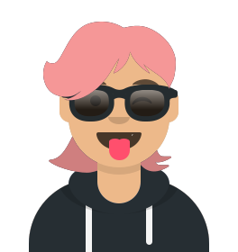

# Hi, I'm Zuza 👋👩‍💻

## 🐈 About Me

I'm a **Front-End Developer** with roots in Poland, based in **the Netherlands**. My background is in marketing, specifically in the music and video game industries, but I've decided to swap Instagram campaigns for cozy VSCode sessions and take a wild leap into Front-End Development. I'm currently on a self-study mission to reach the pinnacle of dev greatness, or at least be the best in the Netherlands... no big deal! 💪

As a neurodivergent woman from a disadvantaged background, I'm especially passionate about breaking down barriers and making a difference in the tech industry. I've got a keen eye for design and a love for experimenting with colours, which is why I find styling UI (especially responsive design) to be one of my favourite parts of the job. So let's build something beautiful together and make the internet a better place (or at least make it look pretty). 🖌️💖

- 😄 Pronouns: _she/her_
- 🌱 I’m currently learning _React.js_
- ⚡ Fun fact: _I'm the rare breed who loves CSS_

---

## ⚒️ My skill set

  
  
  
  
  
  
  
  
  

---

## 🦜 Let's connect

  
  
