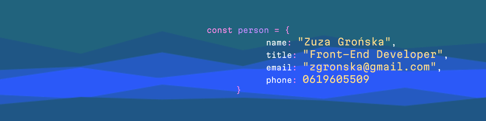

# Hi, I'm Zuza 👋👩‍💻

- 😄 Pronouns: _she/her_
- 🌱 I’m currently learning _SCSS & Vue.js_
- ⚡ Fun fact: _I'm the rare breed who loves CSS_

---

## ⚒️ My skill set

  
  
  
  
  
  
  
  
  

---

## 🦜 Let's connect

  
  
